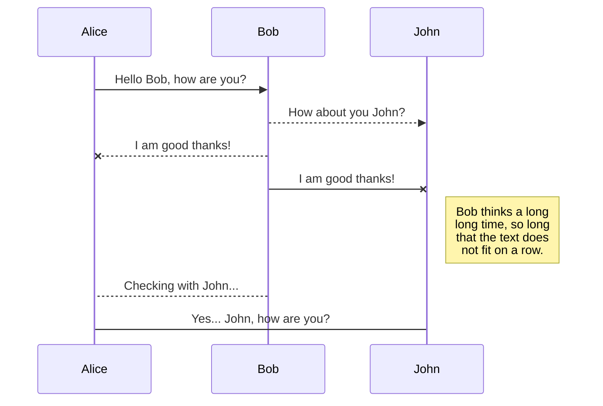

# serverless_demo

**This is an example to deploy a minimum project with `Lambdas` and `Step Functions`**

* Requirements:
    * [Serverless libray](https://serverless.com)
    * [Serveless Installation](https://serverless.com/framework/docs/providers/aws/guide/quick-start/)

* Deploying the stack:
    * ``` sls deploy --stage dev ``` or ```sls deploy -s dev ``` 
    * For the deployment process we have the following options:
```
    Plugin: Deploy
deploy ........................ Deploy a Serverless service
deploy function ............... Deploy a single function from the service
deploy list ................... List deployed version of your Serverless Service
deploy list functions ......... List all the deployed functions and their versions
    --conceal .......................... Hide secrets from the output (e.g. API Gateway key values)
    --stage / -s ....................... Stage of the service
    --region / -r ...................... Region of the service
    --package / -p ..................... Path of the deployment package
    --verbose / -v ..................... Show all stack events during deployment
    --force ............................ Forces a deployment to take place
    --function / -f .................... Function name. Deploys a single function (see 'deploy function')
    --aws-s3-accelerate ................ Enables S3 Transfer Acceleration making uploading artifacts much faster.

```
* Other options from Serverless:
```
config ........................ Configure Serverless
config credentials ............ Configures a new provider profile for the Serverless Framework
create ........................ Create new Serverless service
deploy ........................ Deploy a Serverless service
deploy function ............... Deploy a single function from the service
deploy list ................... List deployed version of your Serverless Service
deploy list functions ......... List all the deployed functions and their versions
info .......................... Display information about the service
install ....................... Install a Serverless service from GitHub or a plugin from the Serverless registry
invoke ........................ Invoke a deployed function
invoke local .................. Invoke function locally
logs .......................... Output the logs of a deployed function
metrics ....................... Show metrics for a specific function
package ....................... Packages a Serverless service
plugin ........................ Plugin management for Serverless
plugin install ................ Install and add a plugin to your service
plugin uninstall .............. Uninstall and remove a plugin from your service
plugin list ................... Lists all available plugins
plugin search ................. Search for plugins
print ......................... Print your compiled and resolved config file
remove ........................ Remove Serverless service and all resources
rollback ...................... Rollback the Serverless service to a specific deployment
rollback function ............. Rollback the function to the previous version
slstats ....................... Enable or disable stats


```

* Serverles allow you to perform many differents deployment operations on your project. 
For more information read the [online documentation](https://serverless.com/framework/docs/providers/aws/guide/) 
* Cosiderations:
    * You should be aware that you need `Template Validation Permissions` for the user that performs the deploy operation.




# WebHook for Tag creation
For get the CodePipeline execution starts when a new tag is created.
1) Get the list of webhooks for the `region`:
```
aws codepipeline list-webhooks --region {region_of_your_pipeline} > all_webhooks.json
```
2) Locate there the pipeline previously created (Let's assume that)
and copy the definition section.
3) Create a weebhool.json file with the following content:
```
{
    "webhook": {
        "name": "The same as original webhook from codepipeline aws list-webhooks",
        "targetPipeline": "The same as original webhook from codepipeline aws list-webhooks",
        "targetAction": "Source",
        "filters": [
            {
                "jsonPath": "$.ref_type",
                "matchEquals": "tag"
            },
            {
                "jsonPath": "$.ref_type",
                "matchEquals": "tag"
            }

        ],
        "authentication": "The same as original webhook from codepipeline aws list-webhooks",
        "authenticationConfiguration": {
            "SecretToken": The one provided by github's webhook"
        }
    }
}
```

Then from you `aws cli` command tool:
```
aws codepipeline put-webhook --cli-input-json file://webhook.json --region {region where your Pipeline was created}
```